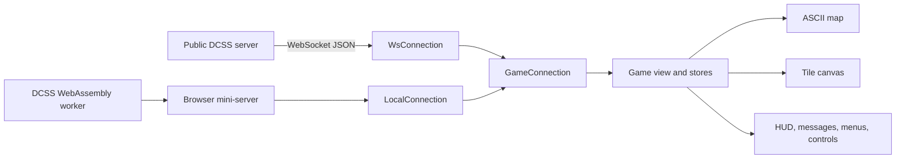

# Learning and hacking on PouchZot

This is a guided map of PouchZot for someone who knows some JavaScript and
wants to understand, debug, and safely change the project. It is not necessary
to read it straight through. Pick a code tour that resembles the feature you
want to change, follow the links, and keep the relevant test open beside it.

PouchZot has no application framework and no backend of its own. It is a
static TypeScript/Vite application. Views create ordinary DOM elements, the
online game speaks WebTiles over a WebSocket, and the offline game substitutes
an in-browser implementation of that same connection boundary.

## Get a development build running

Install the JavaScript dependencies once, then start Vite:

```sh
npm install
npm run dev
```

For another device on the same network:

```sh
npm run dev -- --host 0.0.0.0
```

Open the `Network:` URL Vite prints on your phone. The host firewall and Wi-Fi
client isolation can prevent this even when the local URL works.

The normal development commands are:

```sh
npm run typecheck                     # Type-check application code
npm test -- --run                     # Run all Vitest tests once
npm test -- --run path/to/test.ts     # Run one test file
npm run check                         # Type-check and run all tests
npm run build                         # Check, then create dist/
npm run build:full                    # Build engine and complete offline dist/
npm run preview -- --host 0.0.0.0
```

`npm test` without `-- --run` starts Vitest's watch mode.

## The mental model

There are two ways into one UI:



The important seam is the small
[`GameConnection` interface](../src/ws/connection.ts#L11-L19). `WsConnection`
implements it for public servers and `LocalConnection` implements it for the
local engine. The game and lobby views therefore do not need separate online
and offline versions.

That gives a useful rule of thumb:

- If a change concerns presentation, controls, map state, or interpreting a
  WebTiles message, it probably belongs in shared client code under `src/game/`
  or `src/views/`.
- If online and offline behave differently before a message reaches the game
  view, inspect `src/ws/` and `src/offline/`.
- If the browser receives the wrong WebTiles JSON from a local game, the fix
  may belong in the Crawl fork under `engine/`.

## A small TypeScript translation guide

The code is deliberately close to browser JavaScript. A few TypeScript
features do a lot of work:

- `type` and `interface` describe shapes for the type checker. They disappear
  from the JavaScript bundle.
- `import type { ServerMsg }` imports only a type; it creates no runtime
  dependency.
- `ServerMsg` in [src/ws/types.ts](../src/ws/types.ts) is a discriminated
  union. Inside `if (msg.msg === 'map')`, TypeScript knows which fields can
  exist on `msg`.
- `value?: T` means a property may be omitted. That matters especially for
  WebTiles, whose map and player updates are often sparse deltas.
- `value ?? fallback` uses the fallback only for `null` or `undefined`, while
  `value || fallback` also replaces `0`, `false`, and the empty string. The
  distinction is important when merging server updates.
- `as SomeType` tells the checker what a value should be treated as; it does
  not validate the value at runtime.
- `private` is used for implementation details of classes such as `MapStore`.
  Ordinary closure variables inside a view builder serve a similar purpose.

The compiler settings are in [tsconfig.json](../tsconfig.json). Strict mode is
enabled, no JavaScript is emitted by `tsc`, and Vite handles the actual
transformation and bundling.

## Repository map

| Place | What owns it |
|---|---|
| [src/main.ts](../src/main.ts) | Browser entry point and one-time startup |
| [src/app.ts](../src/app.ts) | Login/lobby/game navigation and connection ownership |
| [src/views/](../src/views/) | Screens, the game coordinator, and overlays |
| [src/game/](../src/game/) | Map, HUD, tiles, input, and reusable game state |
| [src/ws/](../src/ws/) | WebTiles message types and online WebSocket transport |
| [src/offline/](../src/offline/) | Local connection, mini-server, worker, artifacts, and saves |
| [src/sw/](../src/sw/) | Service-worker registration and cache routing |
| [src/golden/](../src/golden/) | Captured WebTiles frames and replay tests |
| [src/style.css](../src/style.css) | Responsive layout and nearly all visual styling |
| [vite.config.ts](../vite.config.ts) | Vite build and generated service worker |
| [engine/](../engine/) | Git submodule containing the PouchZot Crawl fork |

`README.md` is the concise project and repository landing page. `ABOUT.md` is
the longer user-facing copy that the app imports and renders in its About and
Help surfaces; keeping them separate prevents the repository introduction from
becoming the application's manual.

## Code tour 1: startup and view ownership

Start at [src/main.ts](../src/main.ts). It imports the global stylesheet,
initializes UI scaling, calls `initApp`, and registers the service worker.

`initApp` in [src/app.ts](../src/app.ts) decides which top-level route to
mount:

1. A development replay query gets a replay view.
2. `?offline=1` gets the offline lobby or fake engine.
3. A resumable online session attempts to reconnect.
4. Otherwise the login view is shown.

There is no router library. `setView` clears `#app` and appends the element
returned by a view builder. Functions such as `buildLoginView`,
`buildLobbyView`, and `buildGameView` construct DOM and accept callbacks for
navigation.

The active lobby or game view also owns `conn.onMessage`. Mount the view before
starting a producer of messages; the offline boot code explicitly depends on
this ordering.

Things to notice while reading:

- Most view-local state is captured in a function closure rather than stored
  in a framework component.
- Cleanup matters because event listeners and connection callbacks can outlive
  detached DOM.
- Dynamic imports keep offline engine machinery out of the initial production
  chunk; the development guard keeps replay machinery out of production.

## Code tour 2: a touch gesture becomes map zoom

This is a good first tour because the recognizers are small and well tested.

The pure zoom math and both gesture state machines live in
[src/game/map/zoom-gesture.ts](../src/game/map/zoom-gesture.ts). The supported
scale is `0.5` through `2`. One-finger zoom requires a tap followed by a second
tap-and-hold; dragging down zooms in and dragging up zooms out. A quick double
tap alone intentionally does nothing. Pinch uses the ratio between the initial
and current finger span.

The game view binds both recognizers to `#map-wrap` in
[src/views/game-view.ts](../src/views/game-view.ts). That wrapper survives an
ASCII/tiles element replacement. A zoom update follows this path:

```text
pointer/touch event
  -> gesture recognizer computes a clamped scalar
  -> active map view stores the scalar
  -> scheduleFit() queues at most one fit per animation frame
  -> renderer measures and repaints at the new size
```

ASCII and tile rendering are intentionally separate implementations:

- [src/game/map/map-view.ts](../src/game/map/map-view.ts) renders whole text
  cells and may rebuild its viewport when fitting.
- [src/game/map/tile-map-view.ts](../src/game/map/tile-map-view.ts) renders a
  canvas, permits fractional CSS cell sizes, and clips partial edge cells.

Both expose a parallel public surface used by `game-view.ts`: set/get zoom,
set center, fit, and render. `setRenderMode` carries the exact zoom and center
to the replacement renderer. X-mode temporarily applies its own overview
scale but retains the user's selected scale for exit.

Read the tests in
[src/game/map/zoom-gesture.test.ts](../src/game/map/zoom-gesture.test.ts) next.
They test pure math separately from event sequencing. The little synthetic
event helpers exist because happy-dom does not implement all real browser
pointer and touch constructors.

## Code tour 3: a server map update reaches the screen

Online, `WsConnection` parses each WebSocket frame, expands `{ msgs: [...] }`
batches, handles connection-level messages such as `ping`, and forwards the
rest to its current `onMessage` callback.

The game callback is the large `handleMsg` switch in
[src/views/game-view.ts](../src/views/game-view.ts). The exact
[`map` message path](../src/views/game-view.ts#L1311-L1337) is worth studying
because it contains several non-obvious protocol invariants:

1. `clear` wipes prior map knowledge.
2. `map.vgrdc`, not `player.pos`, controls the camera center.
3. `MapStore.merge` applies sparse cell updates and returns dirty coordinates.
4. The renderer chooses a full repaint, a pan-and-repaint, or dirty cells only.
5. Monster views, minimap, and the saved avatar are refreshed afterward.

`MapStore` in [src/game/map/map-store.ts](../src/game/map/map-store.ts) is the
canonical known map, not merely the latest message. Cell coordinates are
delta-encoded: an omitted `x` advances it, while supplied coordinates reset
the cursor. Individual fields are also omitted when unchanged, so merging
must distinguish “absent” from explicit values such as `0`, `false`, or
`null`.

This explains two easy-to-make bugs:

- Centering from every `player.pos` update can disagree with the server's
  intended viewport and break pan repainting.
- Replacing a stored cell with a sparse update loses fields the server assumed
  the client would carry forward.

When adding support for another server message, first add or refine its member
in `ServerMsg`, then add a narrow `handleMsg` case, and put reusable state or
rendering outside the switch when practical.

## Code tour 4: offline is a local WebTiles server

Opening an offline slot dynamically loads `src/offline/boot.ts`. The
[`bootOffline` assembly](../src/offline/boot.ts#L35-L91) creates three pieces:

- `WorkerEnginePort` talks to a module worker running the Emscripten build.
- `createMiniServer` translates between Crawl's IPC-shaped output and
  WebTiles client messages.
- `LocalConnection` presents the same `GameConnection` interface as an online
  WebSocket.

After the game view is mounted, `mini.start()` starts Crawl and sends the
WebTiles `attach` handshake. A key press then makes this round trip:

```text
touch/keyboard -> GameConnection.send
  -> LocalConnection.onSend
  -> mini-server routes text or control input
  -> worker -> WASM Crawl
  -> Crawl emits WebTiles JSON
  -> worker -> mini-server
  -> LocalConnection.deliver
  -> game-view handleMsg
```

The counterpart on the engine side is documented in the
[PouchZot WASM engine guide](../engine/crawl-ref/source/wasm/README.md).
The fork replaces the native WebTiles server's Unix socket and terminal IPC
with JavaScript queues, but tries to preserve the standard message protocol.

Offline data uses several browser storage systems, each for a different job:

| Data | Storage |
|---|---|
| Preferences and control layouts | `localStorage` |
| Offline engine and gamedata pack | Cache Storage, managed by `artifact-store.ts` |
| Crawl saves, morgues, bones, and generated databases | Emscripten IDBFS in IndexedDB |
| App-shell files for PWA startup | Service-worker Cache Storage |

The application service worker does not own the large engine cache. The
worker/artifact layer does, so `/offline/*` requests pass through the service
worker. This separation is useful when debugging “the PWA opens offline”
versus “an offline Crawl game can start”; those are different guarantees.

## Inputs: where a button or key goes

Physical keyboard mapping is in
[src/game/input/keyboard.ts](../src/game/input/keyboard.ts). Touch controls are
built in [src/game/input/touch.ts](../src/game/input/touch.ts), and their named
layouts live in
[src/game/input/control-sets.ts](../src/game/input/control-sets.ts).

`dispatchTouchInput` in `game-view.ts` is the useful choke point. It gives
client-owned overlays and menus first chance to consume an action, then sends
unhandled input through `GameConnection`. Purely visual interactions such as
map zoom never go to Crawl.

When changing an input, decide which of these it is:

- A DCSS command: encode a WebTiles `ClientMsg` and send it.
- Navigation within a client-rendered overlay: handle it locally.
- A presentation gesture: update client state only.

Those categories are exclusive by intent, but an event can accidentally fall
through more than one handler. For example, Esc while the minimap lens is open
must close the client-owned lens and return. If it then reached `conn.send`,
the same tap would also send Esc to DCSS and could cancel a server prompt or
mode underneath. Give each input one owner; when a local layer consumes it,
stop further dispatch.

## Build and deployment layers

There are two independent products involved in an offline deployment.

### 1. The PouchZot application

`npm run build` type-checks and tests first; its Vite stage transforms and
bundles the client, copies `public/`, and generates `dist/sw.js`. If ignored
files already exist under
`public/offline/` and `public/gamedata/local/`, Vite copies them into `dist`.
If they do not exist, the client still builds but has no installable offline
engine pack.

The checked-in [Pages workflow](../.github/workflows/pages.yml) downloads and
verifies the exact engine release pinned by the repository, then runs the
checked Vite build on a clean GitHub runner. It does not compile the engine.

### 2. The Crawl engine and deployable pack

`engine/` is a shallow Git submodule pointing at a direct fork of
`crawl/crawl`. The PouchZot port is maintained as commits on top of a recorded
upstream Crawl base. The release build runs locally so a Pages deployment does
not spend GitHub Actions CPU compiling Crawl and Emscripten.

From `engine/crawl-ref/source`, the release command is:

```sh
./wasm/release.sh
```

It performs the native bootstrap, WASM build, first-boot cache prewarming,
site packaging, source packaging, and checksums without contacting GitHub.
Passing `--publish` additionally creates a GitHub release and enables strict
clean-branch, pushed-commit, and GitHub tooling checks. A local build does not
need GitHub CLI; publishing requires an installed and authenticated `gh`.
Details and manual stages are in the engine guide linked above.

### Full local build without GitHub

To compile both products entirely on the local machine, from source already
present in this checkout, run this at the PouchZot repository root:

```sh
JOBS=8 npm run build:full
```

`JOBS` is optional. The command runs the engine's non-publishing release build,
runs the checked Vite client build, then copies the contents of
`engine/crawl-ref/source/wasm/dist/site/` into `dist/`. The resulting `dist/`
contains the app, local WASM engine, prewarmed caches, and local tiles and can
be served by any static file server. The trailing `/.` in the copy source puts
`offline/`, `gamedata/`, and `release.json` directly at the deployment root.

This path does not use GitHub, GitHub Releases, Actions, or Pages; it does not
change the checked-in engine pin, commit, or push anything. It requires the
engine submodule and its dependency submodules to be present, the native Crawl
build dependencies, PyYAML, and `emcc`/`em++` on `PATH`.

From the PouchZot repository root, the normal publishing command is:

```sh
npm run release:engine
```

That package script deliberately calls `release.sh --publish`, then uses the
existing offline fetch tool's `--update-pin` mode to derive the archive size,
SHA-256, build, engine commit, and Crawl provenance from the generated release
files. It verifies those files against `SHA256SUMS` before replacing the
client's pin. To limit compiler parallelism, set the environment variable,
for example `JOBS=8 npm run release:engine`.

After publishing, the command creates an `Update offline engine release`
commit using an explicit `.github/offline-engine.json` pathspec and pushes
`origin/main`. Other staged or unstaged client changes are not included in the
commit. If the final commit or push fails, the GitHub Release remains published
and the verified pin remains in the working tree so the last steps can be
retried without rebuilding the engine.

The deployable archive contains `offline/`, `gamedata/local/`, and a release
manifest. The Pages workflow reads its pin from
[`.github/offline-engine.json`](../.github/offline-engine.json), downloads
that exact release archive, verifies its pinned size and SHA-256 plus every
file in `release.json`, and installs it under `public/` before the Vite build.
The pin names a specific `engine-<build>` tag; deployment never follows
GitHub's moving “Latest” release pointer. Do not commit the large generated
files; `.gitignore` intentionally excludes them.

To update the engine to newer Crawl, work in the submodule: fetch the selected
upstream commit, merge or rebase the PouchZot commits onto it, update
`wasm/crawl-base` and `wasm/crawl-version`, resolve any source changes, and run
the release-tool and full release checks. The engine modifications are mostly
organized under `wasm/`, but necessarily patch several Crawl C++ files to
replace IPC, persist saves, and expose pre-game output. Do not assume an
upstream merge will always be conflict-free.

Also audit [pocketzot/pocketzot-engine](https://github.com/pocketzot/pocketzot-engine)
as a secondary reference whenever updating Crawl. It is not an upstream to
merge: each release commit contains a complete Crawl snapshot, so a direct
comparison between two of its releases mixes vanilla Crawl updates with
PocketZot engine updates. Instead:

1. Read each new release commit subject to identify its exact vanilla Crawl
   revision.
2. Compare that vanilla revision with its engine snapshot. This reconstructs
   that release's PocketZot-only delta: its `wasm/` files and changes to the
   patched Crawl files.
3. Compare that delta with both the previously reviewed engine release and our
   fork's delta from `wasm/crawl-base`. Review changes by intent and by hunk,
   then port any new fixes that remain relevant on our newer Crawl base; do
   not merge or copy the full snapshot.
4. Record which engine snapshot was reviewed so the next update starts from
   new work rather than auditing the same release again.

Last reviewed 2026-08-19: engine snapshot
[`2949cd55`](https://github.com/pocketzot/pocketzot-engine/commit/2949cd55ee68f94dbb4aeba65313efcc656486e9)
(build `8193075a640d`) uses the same `d8b905dbbe` Crawl baseline as our initial
port. That initial port matches the snapshot's source changes except for the
snapshot-only `util/release_ver`; our subsequent engine commits are additional
local release, portability, and Emscripten work. There was no unported engine
change at this checkpoint.

## Testing strategy

Tests live beside the code and use Vitest:

- Pure functions normally run in Vitest's default Node environment.
- DOM-heavy files start with `// @vitest-environment happy-dom`.
- [src/views/game-view.test.ts](../src/views/game-view.test.ts) mounts the real
  game view with a fake connection and delivers server messages to it.
- [src/offline/offline-integration.test.ts](../src/offline/offline-integration.test.ts)
  covers the local connection and mini-server path.
- [src/golden/golden.test.ts](../src/golden/golden.test.ts) replays captured
  WebTiles traffic through real stores and views.

The fixture capture rules in
[src/golden/CAPTURING.md](../src/golden/CAPTURING.md) are important: captures
must not contain account identity, credentials, chat, or other private data.

A practical loop is:

1. State the behavior in one sentence.
2. Find the narrowest owner with `rg`, for example
   `rg -n "setZoomScale|zoomFromPinch" src`.
3. Add or adjust a focused test before changing the implementation.
4. Run that test repeatedly.
5. Type-check, run the full suite, and manually try the interaction at phone
   dimensions.

For a protocol change, use a realistic sparse message in the test rather than
constructing an unrealistically complete object. For a touch change, test both
the successful gesture and cancellation/ownership boundaries.

## Useful development diagnostics

Development builds expose a few intentionally non-production helpers in the
browser console:

- `window.__dcssWsLog` is a circular log of recent inbound and outbound
  messages. Password and cookie fields are redacted.
- `window.__dcssSimulateIn(message)` delivers a synthetic inbound online
  message.
- `window.__dcssKillSocket()` simulates an unexpected socket loss.
- `window.__pzEngine.debug()` asks a running real offline worker to report its
  queue/wake state.
- `?offline=1&engine=fake&fixture=<name>` drives the game view from a golden
  fixture without starting WASM.
- `?replay=<recording>` opens the development performance replay harness.

Inspect the browser's Application panel when debugging offline behavior. Look
at Service Workers, Cache Storage, and IndexedDB separately; clearing one does
not necessarily clear the others. `?nosw=1` disables and unregisters the
service worker in a production build, which helps distinguish service-worker
cache trouble from application behavior.

## Good first exercises

These are ordered from local and low-risk to cross-cutting. Try writing down
your expected behavior and test before editing the implementation.

1. Change one-finger zoom sensitivity without changing pinch sensitivity.
   Find the drag formula and update its pure-function tests. Verify that the
   min/max limits still hold.
2. Add a tiny pure helper near an existing one, such as a zoom percentage
   formatter, and test boundary values. Then decide where the UI should call
   it rather than coupling DOM into the helper.
3. Add a command to one built-in control set. Follow its serialized form
   through `control-sets.ts` and inspect the resulting `ClientMsg` in
   `__dcssWsLog`.
4. Add a harmless display response to an existing `ServerMsg`. Drive the real
   game view with a fake connection test and send both a full value and an
   omitted sparse update.
5. Add an offline progress or diagnostic message. Trace it from worker to
   mini-server to `LocalConnection`, making sure online game behavior remains
   untouched.

The first two build comfort with TypeScript and tests. The next two teach the
shared UI and WebTiles protocol. The last crosses the online/offline seam and
is best attempted after following the offline tour.

## Before considering a change done

- Search for stale descriptions in `README.md`, `ABOUT.md`, comments, and
  `todo.md` when behavior visible to users changes.
- Test both ASCII and tile maps if map state, centering, fitting, or zoom is
  involved.
- Test cancellation and multiple contacts for touch gestures.
- Preserve `map.vgrdc` camera ownership and sparse-delta merge semantics.
- Check online and offline paths when changing `GameConnection` or message
  routing.
- Run the focused test, full Vitest suite, TypeScript check, and Vite build.
- Do not commit `dist/`, engine archives, generated offline artifacts, account
  details, or captured credentials.

The project is large because it translates a mature game's protocol and UI to
a phone, not because every change requires understanding every subsystem.
Follow one message or interaction end to end, keep the transport boundary in
mind, and let the tests define the part you are changing.
